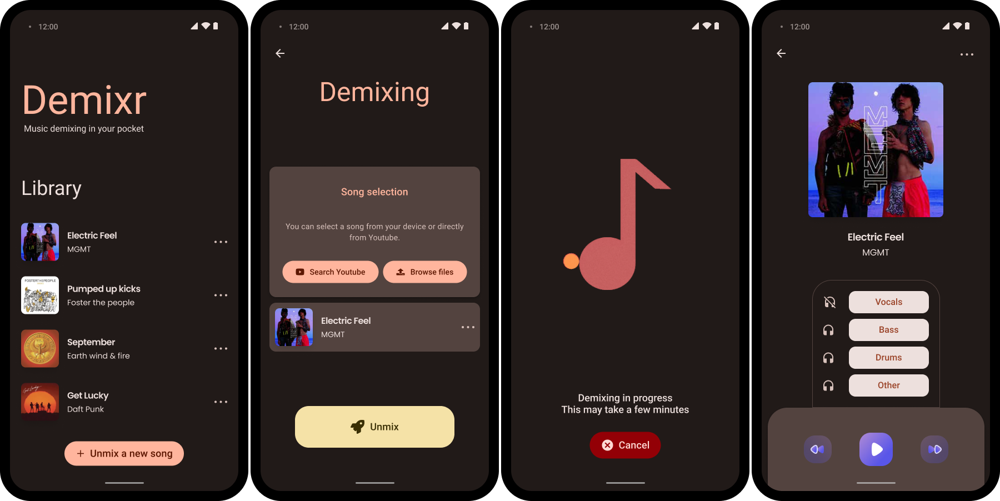

# Demixr mobile application

> Music source separation on mobile

	

> :warning: This project is still in development, all the features might not work perfectly yet

| Platform | Support            |
| -------- | ------------------ |
| Android  | :white_check_mark: |
| IOS      | Coming soon        |

## Music source separation

Music source separation is the task of decomposing music into its constitutive components, e. g., yielding separated stems for the vocals, bass, and drums.

## Features

* Load songs from the device
  * Supported formats: `mp3` and `wav`
* Download songs from YouTube
* Source separation in 4 different stems: `Vocals`, `Bass`, `Drums` and `Other`
* Local library of unmixed songs
* Integrated music player with the ability to mute / unmute each stem

## Demixing

The **demixing** is made using `PyTorch Mobile` and a source separation model optimized for mobile.

### Models

[Open-Unmix](https://github.com/sigsep/open-unmix-pytorch) is a deep neural network reference implementation for music source separation in [Pytorch](https://pytorch.org/).

The models are trained on the [MUSDB18](https://sigsep.github.io/datasets/musdb.html) dataset.

Two of the models are available in the application:

| Model   | Description                                                  |
| ------- | ------------------------------------------------------------ |
| `umxl`  | A model that was trained on extra data which significantly improves the performance, especially generalization. |
| `umxhq` | Default model trained on [MUSDB18-HQ](https://sigsep.github.io/datasets/musdb.html#uncompressed-wav), which comprises the same tracks as in MUSDB18 but un-compressed which yield in a full bandwidth of 22050 Hz. |

In order to use the models on mobile, they are transformed to [torchscript](https://pytorch.org/docs/stable/jit.html) then optimized for mobile and for the `PyTorch Mobile` lite interpreter: https://github.com/demixr/openunmix-torchscript.

Latest mobile build of the models: https://github.com/demixr/openunmix-torchscript/releases/latest/.

## Performance

Using a Pixel 6, demixing a 4-minute audio file takes:
* 3 minutes using the quantized `umxhq` model.
* 4 minutes 10 seconds using the quantized `umxl` model.

The quantized `umxhq` model is around 2.3x faster than the `umxhq` model.
The quantized `umxl` model is at least 3.4x faster the the `umxl` model.

> Note: Inference is done on CPU as GPU is not yet fully supported by PyTorch Mobile.

## Download Demixr

You can download and install the Android application from the [latest Github release](https://github.com/demixr/demixr-app/releases/latest/) by selecting the appropriate platform `apk` file.

## Contributing

You are more than welome to contribute to Demixr, whether it's for:

* Reporting a bug
* Discussing the current state of the code
* Submitting a fix
* Proposing new features
* Becoming a maintainer

### Report a bug

You can report bugs using Github issues. Consider filling in the following informations for an optimal report:

* Quick summary
* Steps to reproduce
* What you expected would happen
* What actually happend
* A screenshot if the bug is graphical

### Submiting a new feature / fix

1. Fork the repo and create your branch from `main`
2. Make sure to add documentation and tests if necessary
3. Create a pull request

## References

* [Open-Unmix](https://sigsep.github.io/open-unmix/)
* [Flutter](https://docs.flutter.dev/)
* [Pytorch Mobile](https://pytorch.org/mobile/home/)
* [Oboe](https://github.com/google/oboe)
* [Youtube Explode Dart](https://github.com/Hexer10/youtube_explode_dart)
* [WaveFiles](http://www.labbookpages.co.uk/audio/javaWavFiles.html)
