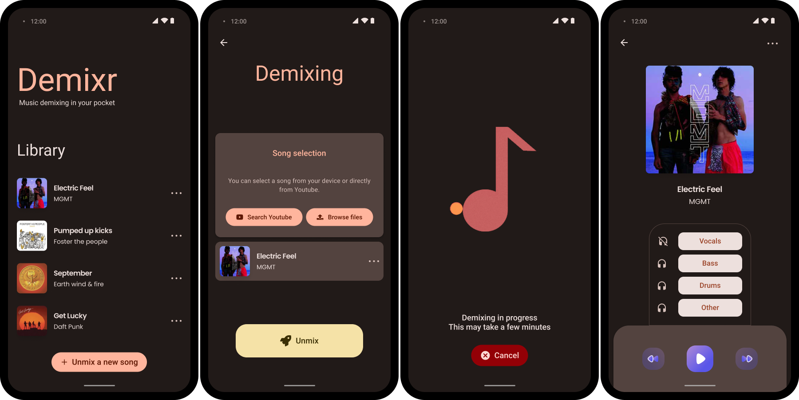

# Demixr mobile application

> Music source separation on mobile

	

> :warning: This project is still in development, all the features might not work perfectly yet

| Platform | Support            |
| -------- | ------------------ |
| Android  | :white_check_mark: |
| IOS      | Coming soon        |

## Music source separation

Music source separation is the task of decomposing music into its constitutive components, e. g., yielding separated stems for the vocals, bass, and drums.

## Features

* Load songs from the device
  * Supported formats: `mp3` and `wav`
* Download songs from YouTube
* Source separation in 4 different stems: `Vocals`, `Bass`, `Drums` and `Other`
* Local library of unmixed songs
* Integrated music player with the ability to mute / unmute each stem

## Demixing

The **demixing** uses [Demucs v4 (htdemucs)](https://github.com/facebookresearch/demucs),
a hybrid-transformer source separation model, and runs cross-platform on
Android, iOS and macOS. The decode, chunked overlap-add and the inverse STFT all
run in Dart; only the conv + transformer core runs on the model runtime.

### Models

The same htdemucs weights ship in two interchangeable backends, selectable at
download time:

| Model           | Engine                  | Notes                                              |
| --------------- | ----------------------- | -------------------------------------------------- |
| htdemucs (GPU)  | ExecuTorch — CoreML (Apple) / Vulkan (Android) | Default. GPU-accelerated; per-platform `.pte`.     |
| htdemucs (ONNX) | ONNX Runtime — CPU      | Cross-platform, smaller download, runs everywhere. |

Both separate audio into 4 stems: `Vocals`, `Drums`, `Bass`, `Other`.

> **No 6-stem model.** A 6-stem htdemucs variant (which adds `Guitar` and
> `Piano`) was evaluated but **excluded** — the guitar and piano separation
> quality was poor in our initial testing, so we kept the app to the 4 stems
> that work well.

The GPU `.pte` exports are built and hosted at
[demixr/demucs-executorch](https://github.com/demixr/demucs-executorch); the
ONNX model is hosted on [Hugging Face](https://huggingface.co/StemSplitio).

## Performance

GPU (ExecuTorch) vs CPU (ONNX) on a 4-minute song, measured:

* **macOS** — GPU ~8.4× faster than CPU.
* **iPhone** — GPU ~2.5× faster than CPU (≈4× on compute, excluding the one-time
  model compile, which is warmed up at download time).

> Note: Inference is done on CPU as GPU is not yet fully supported by PyTorch Mobile.

## Download Demixr

You can download and install the Android application from the [latest Github release](https://github.com/demixr/demixr-app/releases/latest/) by selecting the appropriate platform `apk` file.

## Demo

https://user-images.githubusercontent.com/34341442/151656743-57e4d414-d8a8-4495-962a-55b27e08ab4c.mp4

## Contributing

You are more than welome to contribute to Demixr, whether it's for:

* Reporting a bug
* Discussing the current state of the code
* Submitting a fix
* Proposing new features
* Becoming a maintainer

### Report a bug

You can report bugs using Github issues. Consider filling in the following informations for an optimal report:

* Quick summary
* Steps to reproduce
* What you expected would happen
* What actually happend
* A screenshot if the bug is graphical

### Submiting a new feature / fix

1. Fork the repo and create your branch from `main`
2. Make sure to add documentation and tests if necessary
3. Create a pull request

## References

* [Open-Unmix](https://sigsep.github.io/open-unmix/)
* [Flutter](https://docs.flutter.dev/)
* [Pytorch Mobile](https://pytorch.org/mobile/home/)
* [Oboe](https://github.com/google/oboe)
* [Youtube Explode Dart](https://github.com/Hexer10/youtube_explode_dart)
* [WaveFiles](http://www.labbookpages.co.uk/audio/javaWavFiles.html)
