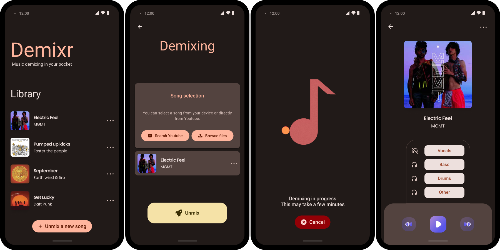

# Demixr

> On-device music source separation and remixing for mobile and desktop

<p align="center">
	
</p>


[](https://github.com/demixr/demixr-app/actions/workflows/release_app.yml)

> :warning: This project is still in development, all the features might not work perfectly yet


| Platform | Support |
| -------- | ------- |
| Android  | :white_check_mark: Downloadable (APK) |
| macOS    | :white_check_mark: Downloadable (.dmg) |
| iOS      | :white_check_mark: Implemented & working — not yet on the App Store* |
| Windows  | :white_check_mark: Downloadable (x64 portable ZIP) |
| Linux    | :white_check_mark: Downloadable (x64 portable tarball) |

<sub>*The iOS build is complete and runs on device; publishing to the App Store / TestFlight requires a paid Apple Developer account ($99/yr), so it isn't distributed yet.</sub>


## Music source separation

Music source separation decomposes a recording into components such as vocals,
bass, drums and other instruments.


## Features

* Load songs from the device
  * Common formats are converted locally through FFmpeg
* Download songs from YouTube
* Source separation in 4 different stems: `Vocals`, `Bass`, `Drums` and `Other`
* Local library of unmixed songs
* Integrated music player with independent volume and mute controls for every stem
* Export the original track, individual stems, all stems, or the current remix
* System media controls on Android, iOS and macOS


## Demixing

The **demixing** uses [Demucs v4 (htdemucs)](https://github.com/facebookresearch/demucs),
a hybrid-transformer source separation model. Separation runs locally on the
device across Android, iOS, macOS, Windows and Linux. Audio decoding, chunked
overlap-add and inverse STFT run in shared Dart code; the neural-network core
runs through the platform's model runtime.


### Models

The same htdemucs weights ship in two interchangeable backends, selectable at
download time:

| Model           | Engine | Notes |
| --------------- | ------ | ----- |
| htdemucs (GPU)  | [ExecuTorch](https://pytorch.org/executorch/) — CoreML (Apple) / Vulkan (Android) | Default on supported mobile and Apple devices; per-platform `.pte`. |
| htdemucs (ONNX) | [ONNX Runtime](https://onnxruntime.ai/) — DirectML (Windows) / CPU fallback | Cross-platform `.onnx`; used on Windows and Linux and available everywhere. |

Both separate audio into 4 stems: `Vocals`, `Drums`, `Bass`, `Other`.

> **No 6-stem model.** A 6-stem htdemucs variant (which adds `Guitar` and
> `Piano`) was evaluated but **excluded** — the guitar and piano separation
> quality was poor in our initial testing, so we kept the app to the 4 stems
> that work well.

The GPU `.pte` exports are built and hosted at
[demixr/demucs-executorch](https://github.com/demixr/demucs-executorch); the
ONNX model is hosted on [Hugging Face](https://huggingface.co/StemSplitio).

## Performance

ExecuTorch GPU vs ONNX CPU on a 4-minute song, measured:

* **macOS** — GPU ~8.4× faster than CPU.
* **iPhone** — GPU ~2.5× faster than CPU (≈4× on compute, excluding the one-time
  model compile, which is warmed up at download time).

Windows prefers ONNX Runtime's DirectML execution provider on compatible
DirectX 12 hardware and automatically falls back to CPU. Linux currently uses
the ONNX CPU backend.

## Download & install

Grab the build for your platform from the [latest GitHub release](https://github.com/demixr/demixr-app/releases/latest/).

### Android (`.apk`)
1. Download the `.apk` from the release.
2. Open it. Android will ask to allow installing from this source — enable it
   (Settings → "Install unknown apps") and confirm.
3. Open Demixr; on first use it downloads the separation model.

### macOS (`.dmg`)
1. Download `demixr-macos.dmg` and open it; drag **Demixr** to **Applications**.
2. The app isn't notarized (it's a free, unsigned build), so the first launch is
   blocked by Gatekeeper. **Right-click the app → Open → Open** once; afterwards
   it launches normally.

### Windows (`.zip`)
1. Download `demixr-windows-x64.zip` and extract it to a permanent folder.
2. Run `Demixr.exe`. Keep the executable and the bundled DLLs together.
3. If Windows SmartScreen appears, choose **More info → Run anyway** for this
   unsigned build.

### Linux (`.tar.gz`)
1. Download `demixr-linux-x64.tar.gz` and extract it to a permanent folder.
2. Run `./Demixr` from the extracted directory.
3. Demixr bundles its inference and FFmpeg libraries, but the system still
   needs GTK 3 and GStreamer runtime libraries. On Ubuntu/Debian:

   ```sh
   sudo apt install libgtk-3-0 libgstreamer1.0-0 gstreamer1.0-plugins-base
   ```

### iOS
The iOS app is implemented and works on device, but it isn't distributed yet:
Apple only allows installs via the App Store / TestFlight, which require a paid
Apple Developer account ($99/yr). It's the same model and engine as the other
platforms (GPU-accelerated via CoreML) — just not published. To run it today you
need to build from source with your own Apple account (`flutter run`).

## Demo

https://user-images.githubusercontent.com/34341442/151656743-57e4d414-d8a8-4495-962a-55b27e08ab4c.mp4

## Contributing

You are welcome to contribute to Demixr by:

* Reporting a bug
* Discussing the current state of the code
* Submitting a fix
* Proposing new features
* Becoming a maintainer

### Report a bug

You can report bugs through GitHub Issues. Please include:

* Quick summary
* Steps to reproduce
* What you expected would happen
* What actually happened
* A screenshot if the bug is graphical

### Submitting a new feature or fix

1. Fork the repo and create your branch from `main`
2. Make sure to add documentation and tests if necessary
3. Create a pull request


## References

* [Demucs](https://github.com/facebookresearch/demucs)
* [ExecuTorch](https://pytorch.org/executorch/)
* [ONNX Runtime](https://onnxruntime.ai/)
* [FFmpeg](https://ffmpeg.org/)
* [Flutter](https://docs.flutter.dev/)
* [Youtube Explode Dart](https://github.com/Hexer10/youtube_explode_dart)
